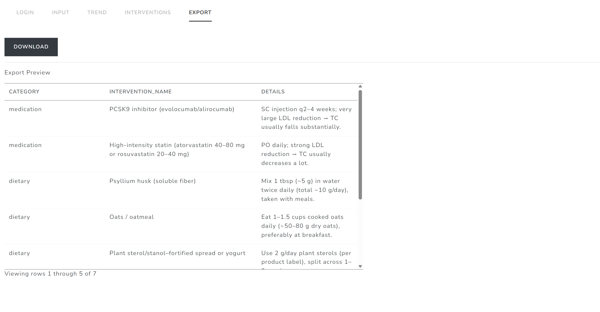

# Lipid Panel Tracker & Intervention Explorer <!-- replace this whole line with the project title-->

## Motivation & Background

<!-- Read the instructions.md file for details on what goes here -->

Lipid-related biomarkers are widely used in biomedical and health sciences to assess cardiometabolic risk and to monitor responses to lifestyle or pharmacologic interventions. In real workflows, longitudinal lipid values (e.g., Total Cholesterol, LDL-C, HDL-C, Triglycerides, Apolipoprotein B and Lipoprotein(a)) are often scattered across lab portals, PDFs, and personal spreadsheets. Meanwhile, information about potential interventions is frequently stored in separate notes or documents, making it time-consuming to connect "what changed in labs" with "what interventions might matter" in a structured, exportable way.

This project proposes an interactive Shiny application that consolidates (1) longitudinal lipid panel tracking and derived metrics with (2) an evidence-based intervention library explorer, enabling quick visualization, interactive exploration, and data export suitable for research/education/demo/daily use.

## App Overview

<!-- Read the instructions.md file for details on what goes here -->

The app contains 5 tabs to support an end-to-end workflow.

1. Login

- Enter a username and press Login button
- Existing records for that user are loaded if available
- If no records exist yet, the user can begin adding new records

2. Input

- Manually enter a lipid panel record for a given date
- Supported biomarkers:
  - Total Cholesterol
  - HDL Cholesterol
  - Triglycerides
  - LDL Cholesterol
  - Apolipoprotein B
  - Lipoprotein(a)
- Blank biomarker entries are saved as `NA`

3. Trend

- Choose a biomarker to visualize over time
- Optionally filter by date range
- Optionally display a reference "least optimal value" line
- Click a point in the interactive time-series plot to update the visit detail panel
- The visit detail panel shows:
  - visit date
  - selected biomarker value
  - all biomarker values at that visit
  - change from the previous visit, when available
  - target status relative to the reference value

4. Intervention

- Select one or more categories:
  - medication
  - dietary
  - exercise
- Select a biomarker
- Generate one or more intervention tables from the internal database
- Select rows from the tables to save interventions of interest
- A side panel displays the currently selected intervention names grouped by category
- Reset button clears all saved selections

5. Export
   Users can export:

- Preview the selected interventions in a table
- Download the selected interventions as a CSV file

Screenshots of the app:

## User Guide

<!-- Read the instructions.md file for details on what goes here -->

1. Log in

- Go to the Login tab, enter a username, and click Login button.
- A demo user is available:
  - Username: Yuan

2. Add a record (optional)

- Go to the Input tab and enter:
  - the date of test
  - one or more biomarker values
- Then click Save.

3. Explore trends

- Go to the Trend tab and:
  - choose a biomarker
  - optionally restrict the date range
  - choose whether to show the reference line
  - click Generate
- Then click a point in the plot to inspect the details for that visit.

4. Explore interventions

- Go to the Interventions tab and:
  - select one or more categories
  - select a biomarker
  - click Generate
- One or more intervention tables will appear. Click rows in the tables to save interventions of interest. The selected intervention names will appear in the panel on the right.
- Use RESET to clear the current selections.

5. Export selected interventions

- Go to the Export tab to preview the currently selected interventions, then click Download to save them as a CSV file.

## Limitations

Current version limitations include:

- user data entry is manual only
- export currently supports CSV only
- no authentication is implemented beyond username-based profile separation

## References

This project uses manually curated biomarker reference values and internal CSV-based intervention dummy tables for demonstration purposes.

---

_This project was crated as part of the BMI 709 course at Harvard Medical
School_
