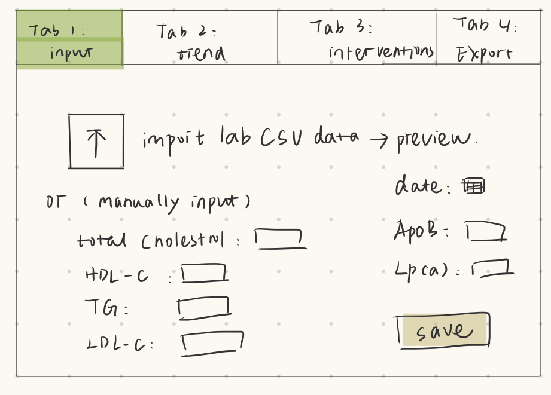
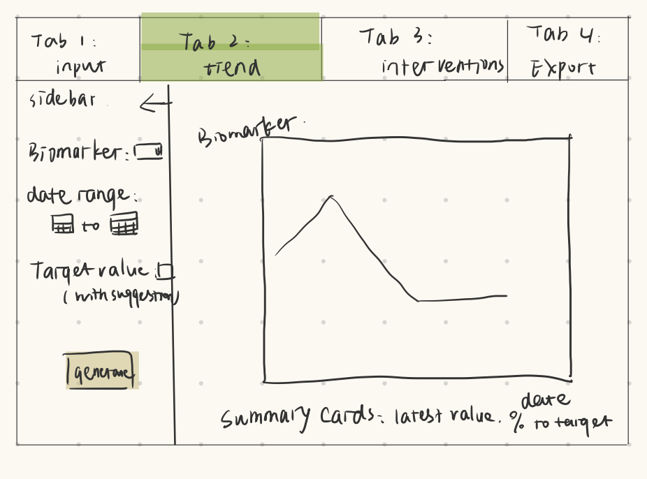
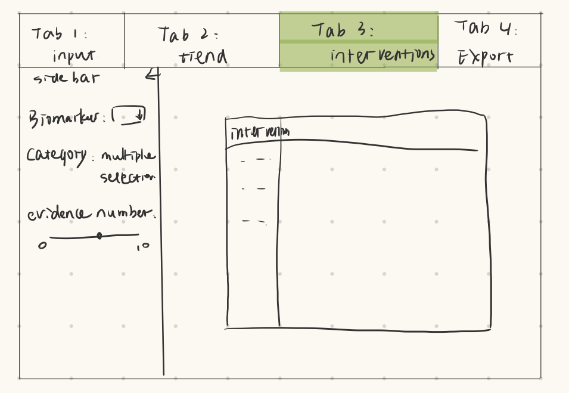
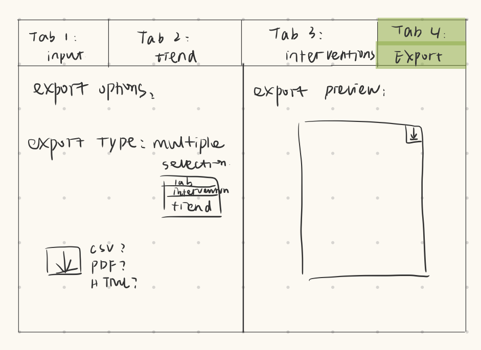

# Lipid Panel Tracker & Intervention Explorer <!-- replace this whole line with the project title-->

## Motivation & Background

<!-- Read the instructions.md file for details on what goes here -->

Lipid-related biomarkers are widely used in biomedical and health sciences to assess cardiometabolic risk and to monitor responses to lifestyle or pharmacologic interventions. In real workflows, longitudinal lipid values (e.g., Total Cholesterol, LDL-C, HDL-C, Triglycerides, Apolipoprotein B and Lipoprotein(a)) are often scattered across lab portals, PDFs, and personal spreadsheets. Meanwhile, information about potential interventions is frequently stored in separate notes or documents, making it time-consuming to connect "what changed in labs" with "what interventions might matter" in a structured, exportable way.

This project proposes an interactive Shiny application that consolidates (1) longitudinal lipid panel tracking and derived metrics with (2) an intervention library explorer, enabling quick visualization, interactive exploration, and data export suitable for research/education/demo use.

## App Overview

<!-- Read the instructions.md file for details on what goes here -->

The app contains 4 tabs to support an end-to-end workflow.

1. Import or enter lipid panel data

   User can bring data into the app via:

- Upload a template CSV/XLSX (recommended for reproducibility)
- Manual entry (date + biomarker values + notes)

2. Interactive trends visualization (server-side interactivity)

- A time-series plot displays selected biomarker trajectories.
- Clicking a point on the plot triggers server-side updates:
  - Selected-visited details (date/value)
  - Change from previous visit
  - Distance to a user-defined target (if applicable)

3. Intervention library explorer (interactive table + detail panel)

- Users filter interventions by biomarker, category, and evidence grade.

4. Export cleaned data and summaries
   Users can export:

- Cleaned/processed lipid dataset (CSV)
- Filtered intervention list (CSV)
- A short summary report (optional HTML/PDF or markdown preview)

Sketches:

## User Guide

<!-- Read the instructions.md file for details on what goes here -->

## References

---

_This project was crated as part of the BMI 709 course at Harvard Medical
School_
